# WordMatch

Gå till [🇸🇪 svensk version](#ordmatch)

### Background
This project was created as a degree project for my Front-End Developer education at Medieinstitutet.

### Project Overview
The Word Match Game is a memory game where players match images with corresponding words. The game has different difficulty levels based on word length or random selection from all levels. Additionally, a classic memory game version is included, offering a simple and relaxing gameplay experience. The classic version has two board sizes: 4x4 (8 pairs) and 6x6 (18 pairs).

## Application Flow

## Purpose
The Word Match Game was inspired by playing similar word games with my son to help him connect letters to words and objects. These games made learning fun, leading to the idea of creating a digital version for others to enjoy. This project offers an engaging educational tool that enhances literacy skills, bridging the gap between visual and linguistic learning.

## Target Audience
- **Children (3-6 years old)**: The game is designed to support early literacy development, offering an engaging learning experience.
- **Parents**: Seeking educational and fun resources for their children's literacy development.
- **Educators**: Looking for innovative, interactive methods to teach students.

## Features

### 1. Home Page
- Users are presented with a button to navigate to a games overview page.
- Navigation bar with links to the game modes and additional resources like FAQ and Contact.

### 2. Games Overview Page
- Users are presented with two buttons navigating to the separate versions of the game:
  - **WordMatching Game View**:
    - Displays a grid of cards with images and words.
    - Displays a drop-down difficulty selector.
    - Displays a mute button to turn off game sounds.
    - Displays a button for option to start over or play again.
    - Tracks user interactions to check if the selected image matches the word.
    - Provides audio feedback for correct matches.
    - Displays a game over modal when all pairs are matched.
  - **Classic Memory Game View**:
    - Displays a grid of image cards.
    - Displays a drop-down game size selector.
    - Displays a mute button to turn off game sounds.
    - Displays a button for option to start over or play again.
    - Tracks user interactions to find matching pairs.
    - Provides audio feedback for correct matches.
    - Displays a game over modal when all pairs are matched.

### 3. Game Over Modal
- Displays a message of “well done” when the game is over.
- Displays a button to close the modal to play again.

### 4. FAQ / More Info
- Displays a fold-out list of questions and answers about the games, background of the project, and information about contact.

### 5. Contact
- Displays a contact form for users to fill in for feedback or questions.
- The contact form uses EmailJS for client-side technologies only. No server is required – one just connects EmailJS to one of the supported email services.

## Project Goals
The goal was to create a fully functional educational game with:
- User-friendly interface and intuitive gameplay
- Different difficulty levels based on word length
- Random word selection across all levels
The game aims to help children develop reading skills in an enjoyable and supportive environment.

## Tech Stack
- **Vite**: Fast development environment
- **React with Styled Components**: Building the UI and game logic
- **TypeScript**: For type safety and clarity
- **Framer-Motion**: Animations and transitions

## Technical Breakdown

### Frontend
- **React (with TypeScript)**: Manages UI components, routing, and game logic.
- **Styled Components**: Dynamic styling based on game state.

### Backend
- **Supabase PostgreSQL Database**: Stores image-urls, words, and matching identifiers.

### Routing and Navigation
- **React Router**: Manages transitions between views for smooth navigation.

### Game Logic
- The game shares a reusable fetch function to handle both game modes and difficulty settings.

### Assets and Storage
- **Supabase Storage Bucket**: Hosts images used in both game modes.

### Deployment
- Hosted on **Netlify** with continuous deployment and responsive performance. Supabase configuration extension is also integrated.

## Database Structure

## Summary
The app is modular and scalable, with clear separation between game modes and logic. It uses Supabase for efficient data storage and Vite/React for a responsive and engaging frontend. This architecture ensures a smooth and intuitive experience for users of all ages.

## Screenshots  

See bottom of page for [screenshots of project](#screenshots)

---

# OrdMatch

Go to [🇬🇧 English Version](#wordmatch)

### Bakgrund
Detta projekt skapades som ett examensprojekt för min utbildning som Front-End Developer på Medieinstitutet.

### Projektöversikt
OrdMatch är ett memoryspel där spelarna matchar bilder med motsvarande ord. Spelet har olika svårighetsgrader baserat på ordlängd eller en slumpmässig urval från alla nivåer. Dessutom finns en klassisk version av Memory, som erbjuder en enkel och avkopplande spelupplevelse. Den klassiska versionen har två olika brädesstorlekar: 4x4 (8 par) och 6x6 (18 par).

## Applikationsflöde

### Syfte
Idén till OrdMatch kom från att leka liknande ordlekar med min son för att hjälpa honom att koppla ihop bokstäver med ord och objekt. Dessa spel gjorde lärandet roligt, vilket ledde till idén att skapa en digital version för andra att njuta av.  
Projektet erbjuder ett engagerande utbildningsverktyg som förbättrar läsfärdigheter och skapar en bro mellan visuell och språklig inlärning.

### Målgrupp
- **Barn (3-6 år gamla)**: Spelet är utformat för att stödja tidig läs- och skrivutveckling och erbjuder en engagerande lärandeupplevelse via lek.
- **Föräldrar**: Söker pedagogiska och roliga resurser för sina barns läsutveckling.
- **Pedagoger**: Letar efter innovativa, interaktiva metoder för att undervisa elever.

## Funktioner

### 1. Startsida
- Användare presenteras med en knapp för att navigera till en översiktssida för spelen.
- Navigeringsmeny med länkar till spelmoderna och ytterligare resurser som FAQ och Kontakt.

### 2. Spelöversikt
- Användare presenteras med två knappar för att navigera till de separata versionerna av spelet:
  - **Ordmatchnings-spelvy**:
    - Visar ett rutnät med kort som har bilder och ord.
    - Visar en rullgardinsmeny för att välja svårighetsgrad.
    - Visar en knapp för att stänga av ljudet.
    - Visar en knapp för att börja om eller spela igen.
    - Spårar användarinteraktioner för att kontrollera om den valda bilden matchar ordet.
    - Ger ljudfeedback för rätt matchningar.
    - Visar en modal för "spel slut" när alla par har matchats.
  - **Klassisk Memory-spelvy**:
    - Visar ett rutnät med bildkort.
    - Visar en rullgardinsmeny för att välja spelstorlek.
    - Visar en knapp för att stänga av ljudet.
    - Visar en knapp för att börja om eller spela igen.
    - Spårar användarinteraktioner för att hitta matchande par.
    - Ger ljudfeedback för rätt matchningar.
    - Visar en modal för "spel slut" när alla par har matchats.

### 3. Spel Slut Modal
- Visar ett meddelande med "bra jobbat" när spelet är slut.
- Visar en knapp för att stänga modalen och börja om.

### 4. FAQ / Mer Information
- Visar en vikbar lista med frågor och svar om spelen, projektets bakgrund och information om kontakt.

### 5. Kontakt
- Visar ett kontaktformulär som användarna kan fylla i för feedback eller frågor.
- Kontaktformuläret använder EmailJS för endast klientteknologier. Ingen server krävs – man kopplar bara EmailJS till en av de stödda e-posttjänsterna.

### Projektmål
Målet var att skapa ett fullt fungerande utbildningsspel med:
- Användarvänligt gränssnitt och intuitiv spelmekanik
- Olika svårighetsgrader baserat på ordlängd
- Slumpmässigt urval av ord från alla nivåer
Spelet syftar till att hjälpa barn att utveckla läsfärdigheter i en rolig och stödjande miljö.

### Teknikstack
- **Vite**: Snabb utvecklingsmiljö
- **React med Styled Components**: Bygger UI och spel-logik
- **TypeScript**: För typ-säkerhet och tydlighet
- **Framer-Motion**: Animationer och övergångar

### Teknisk uppdelning

#### Frontend
- **React (med TypeScript)**: Hanterar UI-komponenter, routing och spel-logik.
- **Styled Components**: Dynamisk styling baserat på spelets tillstånd.

#### Backend
- **Supabase PostgreSQL-databas**: Lagrar bildlänkar, ord och matchande identifierare.

#### Routing och navigering
- **React Router**: Hanterar övergångar mellan vyer för smidig navigering.

#### Spellogik
- Spelet delar en återanvändbar fetch-funktion för att hantera båda spelmoderna och svårighetsinställningarna.

#### Tillgångar och lagring
- **Supabase Storage Bucket**: Lagrar bilder för båda spelmoderna.

#### Deployment
- Hostat på **Netlify** med kontinuerlig deployment och responsiv prestanda. Tillägg för Supabase-konfiguration är också integrerad.

## Databasstruktur

### Sammanfattning
Appen är modulär och responsiv med tydlig separation mellan spelmoderna och logik. Den använder Supabase för effektiv datalagring och Vite/React för ett responsivt och engagerande frontend. Denna arkitektur säkerställer en smidig och intuitiv upplevelse för användare i alla åldrar.

  

### Screenshots / Skärmbilder

#### Start Page / Startsida

    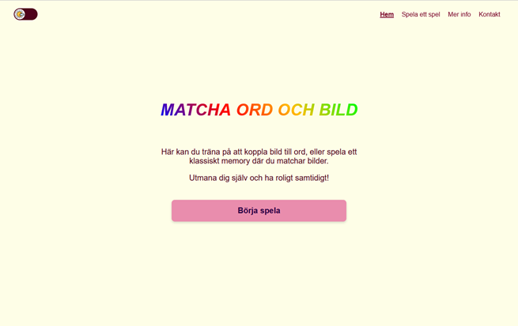
    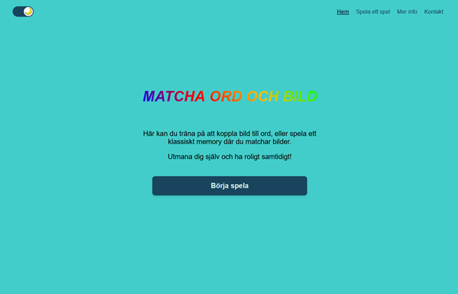

  
🇬🇧 The start page where users can navigate to different game modes

🇸🇪 Startsida där användaren kan navigera till de olika spelversionerna

#### Game Overview / Spelöversikt

    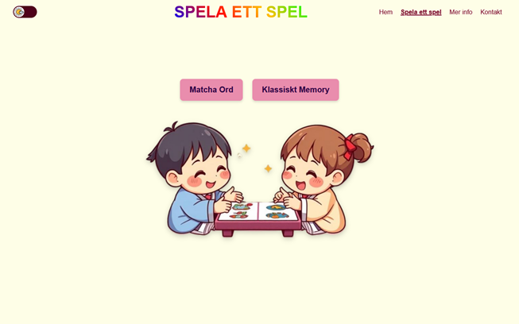
    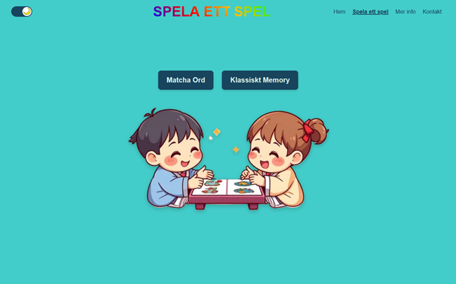

  
🇬🇧 The game overview displaying available game modes  

🇸🇪 Spelöversikt där användaren kan välja mellan de olika spelversionerna</strong>

#### Word Match  / Matcha Ord

    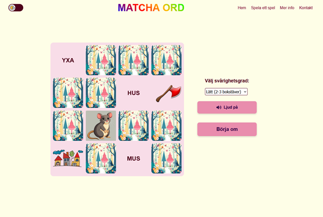

  
🇬🇧 Gameplay for WordMatch  

🇸🇪 Spelläget för Matcha Ord

#### Classic Memory  / Klassiskt Memory

    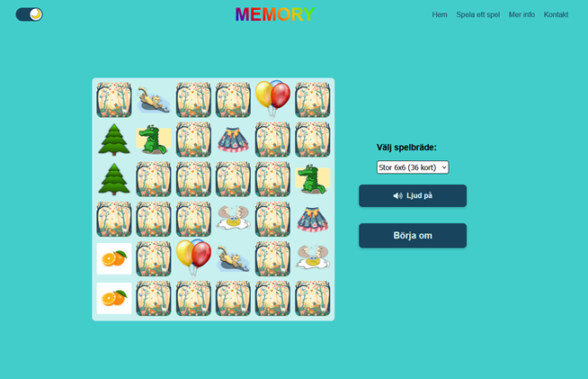

  
Gameplay for Classic Memory  

🇸🇪 Spelläget Klassisk Memory

#### Game Over / Spel avslutat

    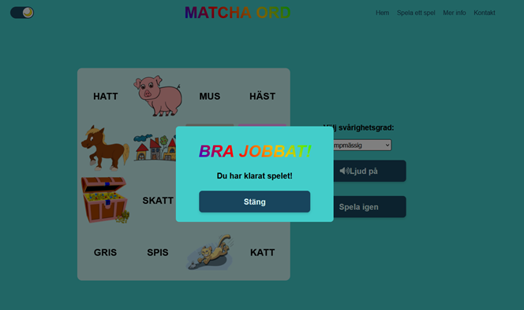

  
🇬🇧 Screen showing Game Over  

🇸🇪 Skärm som visar avslutat spel

#### More Info  / Mer Info

    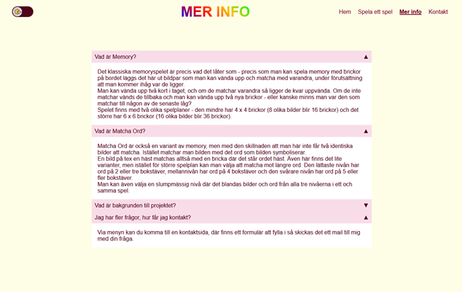
    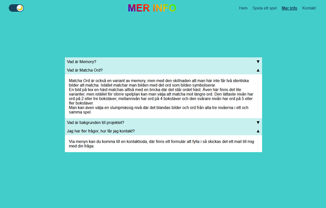

  
🇬🇧 FAQ page providing additional information about the game  

🇸🇪 FAQ-sidan med mer information om spelet

#### Contact Page  / Kontaktsida

    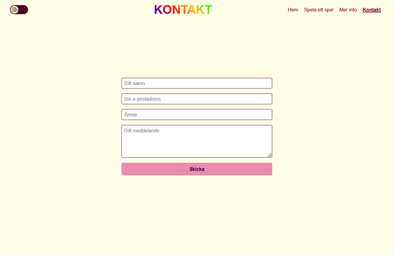
    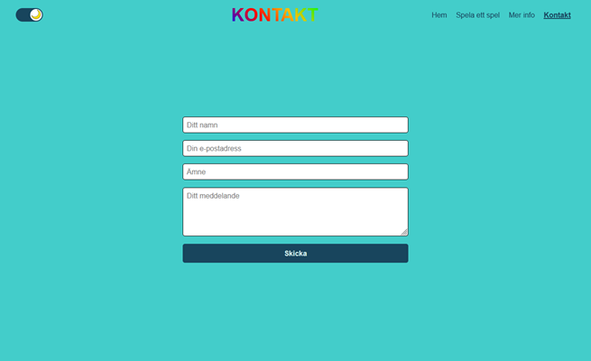

  
🇬🇧 The contact page where users can get in touch via a contact form  

🇸🇪 Kontaktsidan där användaren kan ta kontakt via ett kontaktformulär</strong>  

#### Mobile Navigation  / Mobil navigation

    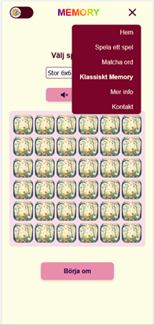
    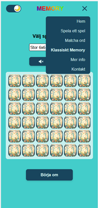

  
🇬🇧 Navigation menu as displayed on mobile devices  

🇸🇪 Navigationsmenyn i mobilvy  
