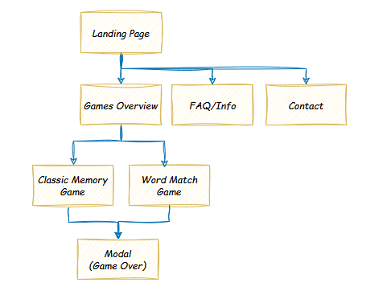
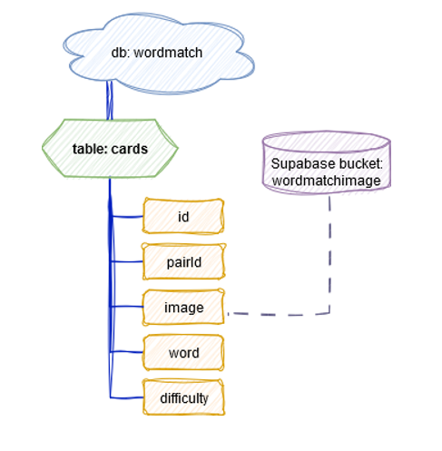

# WordMatch

Gå till [🇸🇪 svensk version](#ordmatch)

### Background
This project was created as a degree project for my Front-End Developer education at Medieinstitutet.

### Project Overview
The Word Match Game is a memory game where players match images with corresponding words. The game has different difficulty levels based on word length or random selection from all levels. Additionally, a classic memory game version is included, offering a simple and relaxing gameplay experience. The classic version has two board sizes: 4x4 (8 pairs) and 6x6 (18 pairs).

## Application Flow

## Purpose
The Word Match Game was inspired by playing similar word games with my son to help him connect letters to words and objects. These games made learning fun, leading to the idea of creating a digital version for others to enjoy. This project offers an engaging educational tool that enhances literacy skills, bridging the gap between visual and linguistic learning.

## Target Audience
- **Children (3-6 years old)**: The game is designed to support early literacy development, offering an engaging learning experience.
- **Parents**: Seeking educational and fun resources for their children's literacy development.
- **Educators**: Looking for innovative, interactive methods to teach students.

## Project Goals
The goal was to create a fully functional educational game with:
- User-friendly interface and intuitive gameplay
- Different difficulty levels based on word length
- Random word selection across all levels
The game aims to help children develop reading skills in an enjoyable and supportive environment.

## Tech Stack
- **Vite**: Fast development environment
- **React with Styled Components**: Building the UI and game logic
- **TypeScript**: For type safety and clarity
- **Framer-Motion**: Animations and transitions

## Technical Breakdown

### Frontend
- **React (with TypeScript)**: Manages UI components, routing, and game logic.
- **Styled Components**: Dynamic styling based on game state.

### Backend
- **Supabase PostgreSQL Database**: Stores images, words, and matching identifiers.

### Routing and Navigation
- **React Router**: Manages transitions between views for smooth navigation.

### Game Logic
- The game shares a reusable fetch function to handle both game modes and difficulty settings.

### Assets and Storage
- **Supabase Storage Bucket**: Hosts images used in both game modes.

### Deployment
- Hosted on **Netlify** with continuous deployment and responsive performance. Supabase configuration extension is also integrated.

## Database Structure

## Summary
The app is modular and scalable, with clear separation between game modes and logic. It uses Supabase for efficient data storage and Vite/React for a responsive and engaging frontend. This architecture ensures a smooth and intuitive experience for users of all ages.

## Screenshots  

See bottom of page for [screenshots of project](#screenshots)

---

# OrdMatch

Go to [🇬🇧 English Version](#wordmatch)

### Bakgrund
Detta projekt skapades som ett examensprojekt för min utbildning som Front-End Developer på Medieinstitutet.

### Projektöversikt
OrdMatch är ett memoryspel där spelarna matchar bilder med motsvarande ord. Spelet har olika svårighetsgrader baserat på ordlängd eller en slumpmässig urval från alla nivåer. Dessutom finns en klassisk version av Memory, som erbjuder en enkel och avkopplande spelupplevelse. Den klassiska versionen har två olika brädesstorlekar: 4x4 (8 par) och 6x6 (18 par).

## Applikationsflöde

### Syfte
Idén till OrdMatch kom från att spela liknande ordspel med min son för att hjälpa honom att koppla ihop bokstäver med ord och objekt. Dessa spel gjorde lärandet roligt, vilket ledde till idén att skapa en digital version för andra att njuta av.  
Projektet erbjuder ett engagerande utbildningsverktyg som förbättrar läsfärdigheter och skapar en bro mellan visuell och språklig inlärning.

### Målgrupp
- **Barn (3-6 år gamla)**: Spelet är utformat för att stödja tidig läs- och skrivutveckling och erbjuder en engagerande lärandeupplevelse.
- **Föräldrar**: Söker pedagogiska och roliga resurser för sina barns läsutveckling.
- **Pedagoger**: Letar efter innovativa, interaktiva metoder för att undervisa elever.

### Projektmål
Målet var att skapa ett fullt fungerande utbildningsspel med:
- Användarvänligt gränssnitt och intuitiv spelmekanik
- Olika svårighetsgrader baserat på ordlängd
- Slumpmässigt urval av ord från alla nivåer
Spelet syftar till att hjälpa barn att utveckla läsfärdigheter i en rolig och stödjande miljö.

### Teknikstack
- **Vite**: Snabb utvecklingsmiljö
- **React med Styled Components**: Bygger UI och spel-logik
- **TypeScript**: För typ-säkerhet och tydlighet
- **Framer-Motion**: Animationer och övergångar

### Teknisk uppdelning

#### Frontend
- **React (med TypeScript)**: Hanterar UI-komponenter, routing och spel-logik.
- **Styled Components**: Dynamisk styling baserat på spelets tillstånd.

#### Backend
- **Supabase PostgreSQL-databas**: Lagrar bilder, ord och matchande identifierare.

#### Routing och navigering
- **React Router**: Hanterar övergångar mellan vyer för smidig navigering.

#### Spellogik
- Spelet delar en återanvändbar fetch-funktion för att hantera båda spelmoderna och svårighetsinställningarna.

#### Tillgångar och lagring
- **Supabase Storage Bucket**: Värdar bilder för båda spelmoderna.

#### Deployment
- Hostat på **Netlify** med kontinuerlig deployment och responsiv prestanda. Supabase-konfigurationsförlängning är också integrerad.

## Databasstruktur

### Sammanfattning
Appen är modulär och skalbar med tydlig separation mellan spelmoderna och logik. Den använder Supabase för effektiv datalagring och Vite/React för ett responsivt och engagerande frontend. Denna arkitektur säkerställer en smidig och intuitiv upplevelse för användare i alla åldrar.

  

### Screenshots
