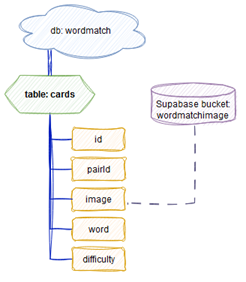

# WordMatch

## Background
This project was created as a degree project for my Front-End Developer education at Medieinstitutet.

## Project Overview
The Word Match Game is a memory game where players match images with corresponding words. The game has different difficulty levels based on word length or random selection from all levels. Additionally, a classic memory game version is included, offering a simple and relaxing gameplay experience. The classic version has two board sizes: 4x4 (8 pairs) and 6x6 (18 pairs).

## Application Flow

## Purpose
The Word Match Game was inspired by playing similar word games with my son to help him connect letters to words and objects. These games made learning fun, leading to the creation of a digital version for others to enjoy. This project offers an engaging educational tool that enhances literacy skills, bridging the gap between visual and linguistic learning.

## Target Audience
- **Children (3-6 years old)**: The game is designed to support early literacy development, offering an engaging learning experience.
- **Parents**: Seeking educational and fun resources for their children's literacy development.
- **Educators**: Looking for innovative, interactive methods to teach students.

## Project Goals
The goal was to create a fully functional educational game with:
- User-friendly interface and intuitive gameplay
- Different difficulty levels based on word length
- Random word selection across all levels
The game aims to help children develop reading skills in an enjoyable and supportive environment.

## Tech Stack
- **Vite**: Fast development environment
- **React with Styled Components**: Building the UI and game logic
- **TypeScript**: For type safety and clarity
- **Framer-Motion**: Animations and transitions

## Technical Breakdown

### Frontend
- **React (with TypeScript)**: Manages UI components, routing, and game logic.
- **Styled Components**: Dynamic styling based on game state.

### Backend
- **Supabase PostgreSQL Database**: Stores images, words, and matching identifiers.

### Routing and Navigation
- **React Router**: Manages transitions between views for smooth navigation.

### Game Logic
- The game shares a reusable fetch function to handle both game modes and difficulty settings.

### Assets and Storage
- **Supabase Storage Bucket**: Hosts images used in both game modes.

### Deployment
- Hosted on **Netlify** with continuous deployment and responsive performance. Supabase configuration extension is also integrated.

## Database Structure

## Summary
The app is modular and scalable, with clear separation between game modes and logic. It uses Supabase for efficient data storage and Vite/React for a responsive and engaging frontend. This architecture ensures a smooth and intuitive experience for users of all ages.

## Screenshots
